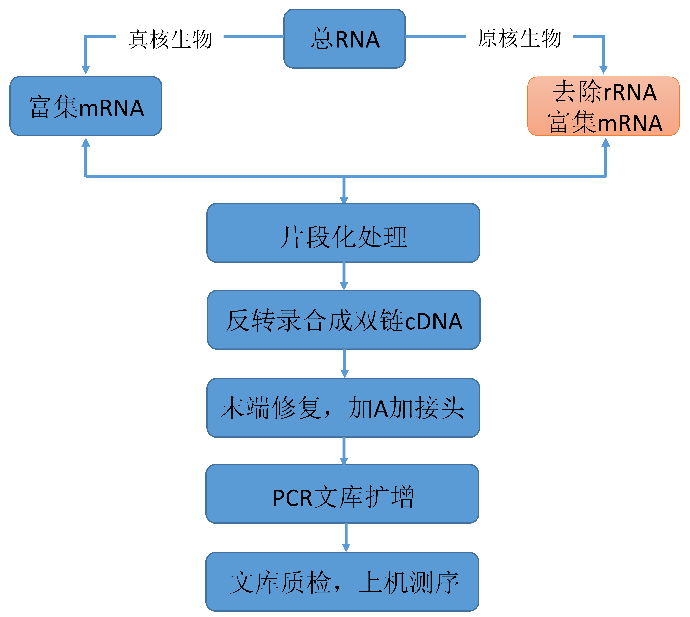
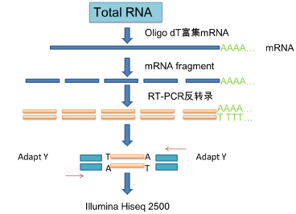
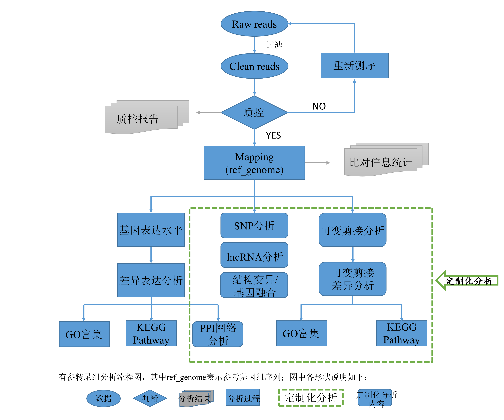
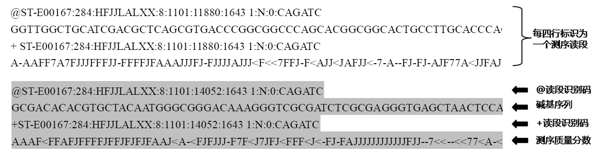

```{r echo=FALSE}
setwd('C:/Users/fursmily/Desktop/inst/rmarkdown/templates/my_template/skeleton')
```


<!---------预留变量----------------------------------------------------->

```{r echo=FALSE, warning=FALSE,message=FALSE}
contract_id <- 'KC2016-A39'
contract_name <- 'UACC-812和MDA-MB-453过表达长链非编码RNA EPB41L4A-AS2后差异表达基因的研究'
clients <- '哈尔滨医科大学'
proxy <- '许守平'
assignee <- '武汉康测科技有限公司'
Finished_date <- '2017-02-20'
s1 <- 549
s2 <- 812
s <- c(s1,s2)

RNA_qc_od <- 'OD260/280正常范围为1.7~2.2，本次检测OD260/280在2.0左右，除812-AS2外，其余样品的OD260/230>2，说明RNA没有杂质污染，纯度较高，812-AS2的RNA中可能有微量的杂质，并不影响后续的建库和测序。28S/18S正常比值应该>1.8，本次检测28S与18S亮度比值>2.0，RNA没有拖带，说明RNA完整性很好。'
RNA_qc_ep <- '本次实验提取的RNA无杂质污染，纯度较高；提取的RNA总量在70ug以上；RNA基本无降解，完整性良好，质检合格，可以进行后续建库实验。'
RNA_lib_qc <- '4个文库插入片段大小均在300-500bp之间，没有拖带，说明文库质量优秀，质检合格，可以上机测序。'
RNA_conc_tb <- 'src/images/RNA_conc.txt'
RNA_ep_fig <- 'src/images/RNA_ep.png'
RNA_lib_qc_tb <- 'src/images/RNA_lib_qc.txt'
RNA_lib_qc_fig <- 'src/images/RNA_lib_qc.png'
```


<!------------#固定变量--------------------------------------------------->


```{r echo=FALSE, warning=FALSE,message=FALSE}
#章节header
headlabel <- paste("<div class='head'><p>合同编号：", contract_id, "</p><hr></div>",sep='')


```


<!------------#固定header------------------------------------------------->
<div class="topheader">
<a href="http://www.seqhealth.cn/" title="seqhealth">
</a>
【`r contract_id`】&nbsp;&nbsp;
title
<!--`r contract_name`-->
<a href="help.html"  title="帮助文档">  </a>
<a href="src/kc_thename_report.pdf" title="点击打开" target="_blank" style="float:right; text-decoration: none; color: green">PDF报告</a>
</div>
<div class="main_page">


<!------------#正文--------------------------------------------------->

#(Contract)合同内容

<table class="table table-bordered" style="margin:40px 0; font-size:16px;color:green;font-weight:bold;font-family:"SimHei";">
<tr>
<td style="width:150px;">合同编号</td><td>`r contract_id`</td>
</tr>
<td style="width:170px;">合同名称</td><td>`r contract_name`</td>
</tr>
<tr>
<td style="width:170px;">委托方（甲方）</td><td>`r clients`</td>
</tr>
<tr>
<td style="width:170px;">委托方代理人</td><td>`r proxy`</td>
</tr>
<tr>
<td style="width:170px;">受托方（乙方）</td><td>`r assignee`</td>
</tr>
<tr>
<td style="width:170px;">结题日期</td><td>`r Finished_date`</td>
</tr>
</table>


|合同编号|KC2016-A39|
|-------|----------|
|合同名称|UACC-812和MDA-MB-453过表达长链非编码RNA EPB41L4A-AS2后差异表达基因的研究|
|委托方（甲方）|哈尔滨医科大学|
|委托方代理人|许守平|
|受托方（乙方）	|武汉康测科技有限公司|
|结题日期	|2017-02-20|


##(Species Info)物种信息


<table class="table table-bordered">
<tr><td>物种名称</td><td>人</td></tr>
<tr><td>拉丁学名</td><td>Homosapiens</td></tr>
<tr><td>参考基因组</td><td>Homo_sapiens.GRCh38</td></tr>
</table>

##(Lib Preparation for Sequencing)建库类型及测序

<table class="contract_tb2 table table-bordered">
<tr><th>客户编号</th><th>康测编号</th><th>RNA/DNA纯化方式</th><th>建库/测序类型</th><th>测序量</th></tr>
<tr><td>对照</td><td>812-Flag</td><td rowspan="4"><br><br>poly A<br><br>去rRNA</td> <td rowspan="4"><br><br><br>mRNA PE150</td><td>6G</td></tr>
<tr><td>UACC-812乳腺癌细胞</td><td>812-AS2</td><td>6G</td></tr>
<tr><td>549-Flag</td><td>549-Flag</td><td>6G</td></tr>
<tr><td>549-AS乳腺癌细胞</td><td>549-AS2</td><td>6G</td></tr>
</table>

##(Service Content)服务内容

1. **数据预处理及分析**
    1. Raw Reads预处理、比对、数据统计及质控；
    2. Reads全基因组分布图；
2. **转录组表达分析**
    1. 基因表达量统计；
    1. 样品表达模式聚类；
    1. 样品间差异表达分析；
    1. 差异表达基因功能通路分析GO&KEGG；
    1. 已知lncRNA表达量统计；
    1. 基于已知lncRNA的样品表达模式聚类；
    1. 已知lncRNA的差异表达分析；
    1. 可变剪接分析；
    1. 差异可变剪接分析；
    1. 差异可变剪接基因功能通路分析GO&KEGG；


<!------#章节header------>
`r headlabel`

#(Workflow)工作流程

<!-- ************工作流程*******************-->

##(Information)背景介绍
&emsp;&emsp;mRNA只占细胞总RNA的3%左右，但由于其最终翻译成蛋白质，参与物种的表型构成，一直是研究的焦点。

&emsp;&emsp;与基因组相比，转录组包含了时间和空间的限定：同一细胞在不同的生长时期及生长环境下，其基因表达情况是不完全相同的。由于转录组远小于基因组，相同覆盖倍数的情况下，所需的测序数据量也远远小于基因组所需数据量，使得转录组测序成为更经济、更有效的研究方案。

&emsp;&emsp;利用高通量测序技术对mRNA进行转录组测序，能够全面快速地获取特定物种组织或细胞在某一状态下的几乎所有转录本的信息，包括碱基序列和基因表达量。
有参考基因组的真核生物转录组项目采用Illumina测序平台，获得测序原始数据后，首先对测序数据进行质控，随后对过滤后的数据进行序列比对，在此基础上，进一步进行多个样本的差异基因表达分析和差异基因功能富集分析等，用于功能基因的发现，为下一步研究提供方向。

##(Experimental Procedures)实验流程

&emsp;&emsp;RNA-Seq文库构建如下图所示，主要包括总RNA提取，RNA建库及上机测序等三个步骤。



##(Total RNA Isolation) 总RNA提取

&emsp;&emsp;RNA的提取方法多种多样，针对客户提供的不同样品我们会选择最适合的提取方法。Trizol提取法是目前使用得最普遍的RNA提取方法，利用Trizol提取法可以获得高质量的总RNA,具体操作步骤如下：

1. 细胞或组织样品加Trizol后，室温放置5min，12,000rpm 离心5min，弃沉淀；

2. 按200μl氯仿/ml Trizol加入氯仿，振荡混匀后室温放置15min，4℃ 12,000g离心15min，吸取上层水相至另一离心管中；

3. 按0.5ml异丙醇/ml Trizol加入异丙醇混匀，室温放置5-10min，4℃ 12,000g离心10min，弃上清，RNA沉于管底；

4. 按1ml 75%乙醇/ml Trizol加入75%乙醇，温和振荡离心管，悬浮沉淀，4℃ 8,000g离心5min，尽量弃上清；

5. 室温晾干或真空干燥5-10min后加入适量TE buffer溶解RNA样品；

6. 利用NanoDrop定量RNA浓度，1%的琼脂糖进行凝胶电泳，观察条带是否完整。

##(RNA lib) RNA建库

&emsp;&emsp;使用Illumina测序仪进行高通量测序必须要构建与之匹配的测序文库，mRNA-seq文库的主要构建流程如下：



&emsp;&emsp;RNA建库的详细步骤如下：

1. 总RNA样本检测合格后，取5μg的总RNA进行后续建库实验；

2. 用带有Oligo(dT)的磁珠富集真核生物mRNA（对于原核生物，则通过试剂盒去除rRNA来富集mRNA），然后加入Fragmentation Buffer将得到的mRNA打断成短片段；

3. 以片段后的mRNA为模板，用六碱基随机引物合成一链cDNA，再加入缓冲液、dNTPs和DNA polymerase I合成二链cDNA；

4. 洗脱纯化的双链cDNA再进行末端修复，加碱基A，加测序接头处理；

5. 利用磁珠回收目的大小片段并进行PCR扩增；

6. 利用琼脂糖电泳方法对所构建的文库进行质检；

7. 利用Qubit 2.0对文库进行定量，确定文库浓度是否适合上机；

8. 文库质检合格后，把不同文库按照有效浓度及目标下机数据量的需求在Illumina测序仪上进行上机测序。


##(Analysis Procedures)分析流程

&emsp;&emsp;高通量测序可以产生海量的测序数据，数据产生以后需要通过生物信息分析方法从数据中获取重要的信息，为后续的科研实验提供坚实的基础。转录组测序的主要生物信息学分析流程如下（绿色虚线框中为定制化项目，其他服务为常规分析项目）：




&emsp;&emsp;RNA-Seq分析主要包括以下步骤：

&emsp;&emsp;获得测序原始数据（raw data）后，首先对原始数据进行过滤，获得高质量的测序数据（clean data），将测序数据（clean data）比对到项目物种的参考基因组上，获得全面转录本信息，并进行基因表达定量，以及GO、KEGG Pathway分析。

&emsp;&emsp;根据客户要求，我们可以提供定制化分析（上图红色虚线方框中的内容），对测序样本进行新基因的预测、可变剪切的分析、SNP分析、lncRNA分析、蛋白互作分析等。


`r headlabel`

#(Result)结果展示及说明
##(Library)建库结果
###(RNA QC)RNA质控

&emsp;&emsp;在RNA建库之前需要对RNA进行质控，来判断实验样品是否合格，只有质检合格的样品才能进行后续建库实验。RNA质控主要包括浓度及纯度测定，RNA完整性检测两方面的内容。

`r RNA_qc_od`


**浓度和纯度测定**。利用NanoDrop OneC来测定总RNA浓度，检测结果如下：


<!------------自动读取(小)表格--------------------------->
<br><br>
<p class="name_tb">RNA浓度展示表</p>
```{r echo=FALSE, warning=FALSE, message=FALSE,results='hide'}
head10_tb <- read.table(RNA_conc_tb, sep='\t',header=T)
library(stargazer)
head10_tb <- stargazer(head10_tb,header=T,summary=FALSE,rownames=FALSE,type="html",title='')
head10_tb[2] <- gsub("td", "th", head10_tb[2])
tablecode <- ''
for (i in head10_tb) {
tablecode <- paste(tablecode, i, sep = '')
}
```
<div class="narrow_tb"><center>
`r tablecode`
</center></div>
<br>

**完整性检测**。利用琼脂糖凝胶电泳方法来检测RNA样品是否发生降解。检测参数设置如下：胶浓度： 1% ；电压：140V ；电泳时间：30min ；上样量：500ng。


<p class="name_fig">RNA电泳图展示</p>

**质检结果**。`r RNA_qc_ep`

###(RNA Lib QC)RNA文库质控

&emsp;&emsp;在RNA上机测序之前需要对RNA文库进行质控，来判断文库质量是否合格，只有质检合格的文库才能上机测序。RNA文库质控主要包括文库浓度测定，文库插入片段大小检测两方面的内容。

&emsp;&emsp;**浓度测定**。利用Qubit 2.0检测构建的RNA文库浓度，为上机测序做准备。具体检测结果如下：


<br><br>
<p class='name_tb'>RNA文库浓度</p>

```{r echo=FALSE, warning=FALSE, message=FALSE,results='hide'}
head10_tb <- read.table(RNA_lib_qc_tb, sep='\t',header=T)
head10_tb <- stargazer(head10_tb,header=T,summary=FALSE,rownames=FALSE,type="html",title='')
head10_tb[2] <- gsub("td", "th", head10_tb[2])
tablecode <- ''
for (i in head10_tb) {
tablecode <- paste(tablecode, i, sep = '')
}
```

<div class="narrow_tb"><center>
`r tablecode`
</center></div>
<br>


&emsp;&emsp;**文库质量检测**。利用琼脂糖凝胶电泳方法来检测RNA文库插入片段大小，是否有拖带等。检测参数设置如下：胶浓度： 1% ；电压：140V ；电泳时间：30min。


&emsp;&emsp;结果说明：`r RNA_lib_qc`

`r headlabel`

##(Data Analysis)数据分析
###(Raw Data)原始数据质控

&emsp;&emsp;数据质控是指对高通量测序产生的海量数据质量进行评估，筛选掉无用数据，保留高质量数据，为后续转录组拼接及相关生物信息分析提供良好的基础。一般来说，测序质量越高，后续数据分析质量也越高，分析结果也更加精确，详实。

**数据产生**

&emsp;&emsp;将Illumina Hiseq 测序得到的原始图像数据经过Base Calling转化为序列数据，即FASTQ格式，得到最原始的测序数据文件。FASTQ格式文件可记录所测读段（read）的碱基及其质量分数。FASTQ格式以测序读段为单位进行存储，每条读段占4行，其中第一行和第三行由文件识别标志（sequence identifiers）和读段名（ID）组成（第一行以“@”开头而第三行以“+”开头；第三行中ID可以省略，但“+”不能省略），第二行为碱基序列，第四行为对应位置碱基的测序质量分数。

<div class='wide_fig>

</div>

<p class='name_fig'>FASTQ格式文件说明</p>

&emsp;&emsp;Read的质量分数以不同的字符来表示，其中每个字符对应的 ASCII 值减去 33，即为对应的测序质量值。一般地，碱基质量从0-40，即对应的ASCII码为从 “！”（0+33）到“I”(40+33）。如果测序错误率用 E（%）表示，Illunima 测序平台的碱基质量值用 Q表示，则有下列关系：

$$Q=-10log_10(E)$$
<br>

<p class="name_tb">测序错误率与测序质量值简明对应关系</p>
<table class="table table-bordered">
<tr>
<td>测序错误率（%）</td>
<td>测序质量值</td>
<td>对应ASCII码</td>
</tr>
<tr>
<td>5</td>
<td>13</td>
<td>.</td>
</tr>
<tr>
<td>1</td>
<td>20</td>
<td>5</td>
</tr>
<tr>
<td>0.1</td>
<td>30</td>
<td>?</td>
</tr>
<tr>
<td>0.01</td>
<td>40</td>
<td>I</td>
</tr>
</table>
<br>

&emsp;&emsp;测序Reads的错误率会随着测序的进行而升高，是由测序过程中化学试剂的消耗造成，这是 Illumina 高通量测序平台通有的特征。

**数据质控**

&emsp;&emsp;转录组测序项目在Illumina测序平台上完成，构建Illumina PE文库（~300bp）进行测序，对获得的测序数据进行质量控制，之后利用生物信息学手段对转录组数据进行分析。

&emsp;&emsp;Illumina 测序属于第二代测序技术，单次运行能产生数十亿级的reads，如此海量的数据无法逐个展示每条Reads的质量情况；生物信息分析运用统计学的方法，对所有测序Reads的每个circle进行碱基分布和质量波动的统计，可以从宏观上直观地反映出样本的测序质量和文库构建质量。

&emsp;&emsp;转录组测序一般为双端测序（paired-end），简称PE测序，是针对建库产生的片段（fragments）从5’和3’端两端分别测序，产生的序列为paired-end reads，分别为Read 1和Read 2。

&emsp;&emsp;为了获知测序质量的高低，在测序数据下机后必须对测序数据进行质控,质控内容包括碱基质量分布、碱基平衡性分析和重复序列水平等方面。


**碱基质量分布**

&emsp;&emsp;测序数据下机后，获得每个样品的原始测序序列，我们称为raw data或raw reads，以FASTQ（简写为fq）文件格式存储。对raw data进行质量评估（软件：FastQC），FastQC是一款数据质量可视化软件，其旨在提供一种简单的方式来评估数据质量来指导下游分析是否继续或如何进行。


<!------------自动生成多图框--------------------------->

<br><br>
```{r echo=FALSE}
i=1
li_fig <- 0
fig_qc_raw <- 0
diff_name <- c('-AS2.R1','-AS2.R2','-Flag.R1','-Flag.R2')
for (n in s) {
  for (m in diff_name) {
    fig_qc_raw[i] <- paste('src/results/1.QC/raw/',n,m,'_fastqc/Images/per_base_quality.png',sep='')
    li_fig[i] <- paste(
      "<li><a id='example2' href='",
      fig_qc_raw[i],
      "' ></a></li>",sep='')
      i=i+1
  }
}
full_fig <- paste("<div class='fullview'></div>",sep='')
```
<p class="center">
<div class="albumSlider">
`r full_fig`
<div class="slider">
<div class="button movebackward" title="向上滚动"></div>
<div class="imglistwrap">
<ul class="imglist">
`r li_fig`
</ul>
</div>
<div class="button moveforward" title="向下滚动"></div>
</div>
</div>
</p>
<p class="name_fig">样品`r s`的Raw Reads碱基质量分布</p>
<br>
<div style="color:grey;">
&emsp;&emsp;注：以盒形图的方式给出序列中每个位点对应的碱基质量分布的结果。
<br>
&emsp;&emsp;X轴是read中的碱基位置（1-150），Y轴是碱基质量；盒形图中间的红线表示中位数（median value）；黄色部分代表四分位距（25-75%）；上下分割线代表90%和10%的上下临界值；蓝色的线代表碱基质量的平均值。
<br>
&emsp;&emsp;碱基质量（Q值），-10*log10(p)，p为测错的概率。所以一条read某位置出错概率为0.01时，其quality就是20，通常认为Q20反映了数据的质量。Y轴将质量值被划分三部分：绿色（高质量），橘黄色（中等质量）和红色（低质量）。由于在每一个测序反应开始后，碱基的信号质量会逐渐降低，因此在每个读长最后的碱基通常都会处于橘黄色的中等质量区。
<br><br>
</div>


**碱基平衡性分析**
&emsp;&emsp;碱基平衡性分析主要用于检测测序数据是否存在AT、GC 分离现象。通常这种现象由建库或测序引入，并影响后续的生物信息分析结果，碱基分布结果见下图。结果显示，建库和测序表现出较好的均一度，可以进行后续信息分析。

<br><br>
```{r echo=FALSE}
i=1
li_fig <- 0
fig_qc_clean <- 0
diff_name <- c('-AS2.R1','-AS2.R2','-Flag.R1','-Flag.R2')
for (n in s) {
  for (m in diff_name) {
    fig_qc_clean[i] <- paste('src/results/1.QC/raw/',n,m,'_fastqc/Images/per_base_sequence_content.png',sep='')
    li_fig[i] <- paste(
      "<li><a id='example2' href='",
      fig_qc_clean[i],
      "' ></a></li>",sep='')
      i=i+1
  }
}
full_fig <- paste("<div class='fullview'></div>",sep='')
```

<p class="center">
<div class="albumSlider">
`r full_fig`
<div class="slider">
<div class="button movebackward" title="向上滚动"></div>
<div class="imglistwrap">
<ul class="imglist">
`r li_fig`
</ul>
</div>
<div class="button moveforward" title="向下滚动"></div>
</div>
</div>
</p>
<p class="name_fig">样品`r s`的Raw Reads碱基平衡性</p>
<br>
<div style="color:grey;">
&emsp;&emsp;注：图为序列每个位点上碱基（A/T/C/G）含量统计的结果。
<br>
&emsp;&emsp;横坐标为read中的碱基位置（1-150bp），纵坐标为对应位点上单个碱基所占的比例。不同颜色代表不同的碱基类别。正常情况下四种碱基的出现频率应该是接近的，而且没有位置差异。因此好的样本中四条线应该平行且接近。当部分位置碱基的比例出现bias时，即四条线在某些位置纷乱交织，往往提示我们有overrepresented sequence的污染。当所有位置的碱基比例一致的表现出bias时，即四条线平行但分开，往往代表文库有bias (建库过程或本身特点)，或者是测序中的系统误差。
<br><br>
</div>


**重复序列水平**

&emsp;&emsp;测序深度越高，越容易产生一定程度的重复（duplication），这属于正常的现象。但如果duplication的程度很高，就提示我们可能有bias的存在（如建库过程中由于PCR扩增引起的 duplication）。

<br><br>
```{r echo=FALSE}
i=1
li_fig <- 0
fig_qc_clean <- 0
diff_name <- c('-AS2.R1','-AS2.R2','-Flag.R1','-Flag.R2')
for (n in s) {
  for (m in diff_name) {
    fig_qc_clean[i] <- paste('src/results/1.QC/raw/',n,m,'_fastqc/Images/duplication_levels.png',sep='')
    li_fig[i] <- paste(
      "<li><a id='example2' href='",
      fig_qc_clean[i],
      "' ></a></li>",sep='')
      i=i+1
  }
}
full_fig <- paste("<div class='fullview'></div>",sep='')
```

<p class="center">
<div class="albumSlider">
`r full_fig`
<div class="slider">
<div class="button movebackward" title="向上滚动"></div>
<div class="imglistwrap">
<ul class="imglist">
`r li_fig`
</ul>
</div>
<div class="button moveforward" title="向下滚动"></div>
</div>
</div>
</p>
<p class="name_fig">样品`r s`的Raw Reads重复序列频率统计</p>
<br>
<div style="color:grey;">
&emsp;&emsp;注：图为序列完全一样的reads的频率统计结果。
<br>
&emsp;&emsp;横坐标为reads重复的次数，纵坐标为重复次数对应的reads占unique reads的比例，以unique reads的总数作为100%。这里，我们仅对文件前2000，000个reads进行统计：对长度>75bp的reads将其截短为50bp，用于统计重复。
<br><br>
</div>


###(Clean Data)clean后的数据质控

&emsp;&emsp;测序数据包含一些带接头（adaptor）、低质量的reads，这些序列会对后续的信息分析造成很大的干扰。为了保证后续信息分析质量，需要对测序数据进行进一步过滤。数据过滤的标准主要包括以下几点：

1. 接头污染去除。去除3' 端的接头污染，至少10 bp overlap（AGATCGGAAG），允许20% 的碱基错误率；
2. reads过滤。去除含N（N表示无法确定碱基信息）较多（≥10%）的reads；
3. 质量过滤。去除低质量的序列（Q≤10的碱基占整体序列碱基数目的50%以上，我们即认为是低质量的序列）。

&emsp;&emsp;我们使用Trimmomatic软件对raw data进行Clean。Trimmomatic软件是一种针对Illumina测序平台开发的一种处理测序原始数据的生物信息学软件。去掉接头、低质量的reads后，需要对clean reads进行新一轮质控，得到clean reads的数据信息。

**碱基质量分布**

&emsp;&emsp;测序数据（clean data）碱基质量分布结果如下：

<br><br>
```{r echo=FALSE}
i=1
li_fig <- 0
fig_qc_clean <- 0
diff_name <- c('-AS2.R1','-AS2.R2','-Flag.R1','-Flag.R2')
for (n in s) {
  for (m in diff_name) {
    fig_qc_clean[i] <- paste('src/results/1.QC/clean/',n,m,'.clean.paired_fastqc/Images/per_base_quality.png',sep='')
    li_fig[i] <- paste(
      "<li><a id='example2' href='",
      fig_qc_clean[i],
      "' ></a></li>",sep='')
      i=i+1
  }
}
full_fig <- paste("<div class='fullview'></div>",sep='')
```

<p class="center">
<div class="albumSlider">
`r full_fig`
<div class="slider">
<div class="button movebackward" title="向上滚动"></div>
<div class="imglistwrap">
<ul class="imglist">
`r li_fig`
</ul>
</div>
<div class="button moveforward" title="向下滚动"></div>
</div>
</div>
</p>
<br>
<p class="name_fig">样品`r s`的Clean Reads碱基质量分布</p>
<br>
<div style="color:grey;">
&emsp;&emsp;注：以盒形图的方式给出序列中每个位点对应的碱基质量分布的结果。
<br>
&emsp;&emsp;X轴是read中的碱基位置（1-150），Y轴是碱基质量；盒形图中间的红线表示中位数（median value）；黄色部分代表四分位距（25-75%）；上下分割线代表90%和10%的上下临界值；蓝色的线代表碱基质量的平均值。
<br>
&emsp;&emsp;碱基质量（Q值），-10*log10(p)，p为测错的概率。所以一条read某位置出错概率为0.01时，其quality就是20，通常认为Q20反映了数据的质量。Y轴将质量值被划分三部分：绿色（高质量），橘黄色（中等质量）和红色（低质量）。由于在每一个测序反应开始后，碱基的信号质量会逐渐降低，因此在每个读长最后的碱基通常都会处于橘黄色的中等质量区。
<br><br>
</div>

**碱基平衡性分析**
&emsp;&emsp;测序数据（clean data）碱基平衡性分析结果如下：

<br><br>
```{r echo=FALSE}
i=1
li_fig <- 0
fig_qc_clean <- 0
diff_name <- c('-AS2.R1','-AS2.R2','-Flag.R1','-Flag.R2')
for (n in s) {
  for (m in diff_name) {
    fig_qc_clean[i] <- paste('src/results/1.QC/clean/',n,m,'.clean.paired_fastqc/Images/per_base_sequence_content.png',sep='')
    li_fig[i] <- paste(
      "<li><a id='example2' href='",
      fig_qc_clean[i],
      "' ></a></li>",sep='')
      i=i+1
  }
}
full_fig <- paste("<div class='fullview'></div>",sep='')
```

<p class="center">
<div class="albumSlider">
`r full_fig`
<div class="slider">
<div class="button movebackward" title="向上滚动"></div>
<div class="imglistwrap">
<ul class="imglist">
`r li_fig`
</ul>
</div>
<div class="button moveforward" title="向下滚动"></div>
</div>
</div>
</p>
<p class="name_fig">样品`r s`的Clean Reads碱基平衡性</p>
<br>
<div style="color:grey;">
&emsp;&emsp;注：图为序列每个位点上碱基（A/T/C/G）含量统计的结果。
<br>
&emsp;&emsp;横坐标为read中的碱基位置（1-150bp），纵坐标为对应位点上单个碱基所占的比例。不同颜色代表不同的碱基类别。正常情况下四种碱基的出现频率应该是接近的，而且没有位置差异。因此好的样本中四条线应该平行且接近。当部分位置碱基的比例出现bias时，即四条线在某些位置纷乱交织，往往提示我们有overrepresented sequence的污染。当所有位置的碱基比例一致的表现出bias时，即四条线平行但分开，往往代表文库有bias (建库过程或本身特点)，或者是测序中的系统误差。
<br><br>
</div>

**重复序列水平**

&emsp;&emsp;测序数据（clean data）重复序列水平结果如下：

<br><br>
```{r echo=FALSE}
i=1
li_fig <- 0
fig_qc_clean <- 0
diff_name <- c('-AS2.R1','-AS2.R2','-Flag.R1','-Flag.R2')
for (n in s) {
  for (m in diff_name) {
    fig_qc_clean[i] <- paste('src/results/1.QC/clean/',n,m,'.clean.paired_fastqc/Images/duplication_levels.png',sep='')
    li_fig[i] <- paste(
      "<li><a id='example2' href='",
      fig_qc_clean[i],
      "' ></a></li>",sep='')
      i=i+1
  }
}
full_fig <- paste("<div class='fullview'></div>",sep='')
```

<p class="center">
<div class="albumSlider">
`r full_fig`
<div class="slider">
<div class="button movebackward" title="向上滚动"></div>
<div class="imglistwrap">
<ul class="imglist">
`r li_fig`
</ul>
</div>
<div class="button moveforward" title="向下滚动"></div>
</div>
</div>
</p>
<p class="name_fig">样品`r s`的Clean Reads重复序列频率统计</p>
<br>
<div style="color:grey;">
&emsp;&emsp;注：图为序列完全一样的reads的频率统计结果。
<br>
&emsp;&emsp;横坐标为reads重复的次数，纵坐标为重复次数对应的reads占unique reads的比例，以unique reads的总数作为100%。这里，我们仅对文件前2000，000个reads进行统计：对长度>75bp的reads将其截短为50bp，用于统计重复。
<br><br>
</div>

**Clean data质量信息**

&emsp;&emsp;我们对clean data的质量信息进行统计，如下所示：


<!---------------------自动读取大表格----------------------------------->
<br><br>
<p class="name_tb">clean data基本信息一览表</p>

```{r echo=FALSE, warning=FALSE, message=FALSE,results='hide'}
pt <- file('src/results/1.QC/clean_results_table.csv', "r")
headline <- readLines(pt, 1)
name <- strsplit(headline, split=',')[[1]];
name <- sub("(%)", "_percent", name,fixed = TRUE)
f1 <- readLines(pt, 10)
data_tb <- read.table(text=f1, sep=',', col.names=name)
close(pt)

head10_tb <- stargazer(data_tb,header=T,summary=FALSE,rownames=FALSE,type="html",digits=5)
head10_tb[2] <- gsub("td", "th", head10_tb[2])
tablecode <- ''
for (i in head10_tb) {
tablecode <- paste(tablecode, i, sep = '')
}
tablecode <- sub("X.GC", "GC(%)", tablecode)
tablecode <- gsub("_percent", "(%)", tablecode)
```

<div class="wide_tb">
`r tablecode`
</div>
<br>

<div style="color:grey;">
&emsp;&emsp;注：
<br>&emsp;&emsp;1. Sample：样品名称；
<br>&emsp;&emsp;2. raw_reads：原始序列总数；
<br>&emsp;&emsp;3. clean_reads：过滤后序列总数；
<br>&emsp;&emsp;4. Reads_clean_ratio(%)：clean reads在原始序列中所占的比例（clean_reads * 100% / raw_reads）；
<br>&emsp;&emsp;5. raw_bases：原始序列碱基总数（raw_bases = raw_reads * sequence length）；
<br>&emsp;&emsp;6. clean_bases：过滤后序列的碱基总数；
<br>&emsp;&emsp;7. Base_clean_ratio(%)：clean_bases 在原始序列碱基中所占的比例（clean_bases * 100% / raw_bases）；
<br>&emsp;&emsp;8. Q20(%)，Q30(%)：分别计算过滤后序列中碱基质量大于20，30的碱基所占的比例；
<br>&emsp;&emsp;9. Unique_reads_ratio(%)：过滤后unique reads在clean reads中所占的比例；
<br>&emsp;&emsp;10. GC(%)：过滤后序列的G和C的数量总和占总的碱基数量的比例。
<br><br>
</div>

结果说明：通过对质控之前的raw data和质控之后的clean data进行统计分析，得出以下结论：

1. 碱基质量较高；Q30达到96.48%以上；

2. 碱基平衡性优秀；

3. 重复达到10次或者10次以上的reads数占总clean reads数的20%以下，各样品的总的重复程度小于45%，因此后续分析没有采用去重（de-duplication）处理；

4. 全部文库的数据获得量均大于合同约定的6G Clean data。


###(Sequence Alignment)参考序列比对

**序列比对到参考基因组上的情况**

&emsp;&emsp;将clean data与参考基因组进行比对，获得全面的转录本信息。在参考基因组选择合适且相关实验不存在污染的情况下，实验产生的测序序列定位到参考基因组上的百分比一般会高于70%（Total Mapped Reads or Fragments），其中具有多个定位的测序序列（Multiple Mapped Reads or Fragments）占总体的百分比通常不会超过10%。比对情况见下表：


<br><br>
<p class="name_tb">clean data比对信息统计表</p>

```{r echo=FALSE, warning=FALSE, message=FALSE,results='hide'}
pt <- file('src/results/2.mapping/mapping_stats.xls', "r")
f1 <- readLines(pt, 30)
f1 <- gsub(" ", "_", f1,fixed=TRUE)
f1 <- gsub("to_+", "to_up", f1,fixed=TRUE)
f1 <- gsub("to_-", "to_down", f1,fixed=TRUE)
data_tb <- read.table(text=f1, sep='\t')
data_tb <- t(data_tb)
colnames(data_tb) <- data_tb[1,]
data_tb <- data_tb[-1,]
close(pt)

head10_tb <- stargazer(data_tb,header=T,summary=FALSE,rownames=FALSE,type="html",digits=5)
head10_tb[2] <- gsub("td", "th", head10_tb[2])
tablecode <- ''
for (i in head10_tb) {
tablecode <- paste(tablecode, i, sep = '')
}
tablecode <- sub("map_to_up", "map to +", tablecode)
tablecode <- gsub("map_to_down", "map to -", tablecode)
```

<div class="wide_tb">
`r tablecode`
</div>
<br>

<div style="color:grey;">
注：
<br>&emsp;&emsp;1. Sample：样品名称；
<br>&emsp;&emsp;2. Total Reads：clean reads的序列总数；
<br>&emsp;&emsp;3. Total mapped：比对到参考基因组上的序列总数；
<br>&emsp;&emsp;4. unique mapped：在参考序列上有唯一比对位置的序列数目；
<br>&emsp;&emsp;5. multiple mapped：在参考序列上有多个比对位置的序列数目；
<br>&emsp;&emsp;6. Unmapped Reads：未能比对到参考序列上的序列数目；
<br>&emsp;&emsp;7. read1，read2：序列两端分别定位到参考基因组上的数量，两部分所占比例应该大体相同；
<br>&emsp;&emsp;8. map to +，map to -：分别比对到参考基因组上的正链序列数目、负链序列数目；
<br>&emsp;&emsp;9. non-splice reads：整段比对到外显子的序列数目；
<br>&emsp;&emsp;10. splice reads：分段比对到两个外显子上的序列数目；
<br>&emsp;&emsp;11. Reads mapped in proper pairs：read1和read2同时比对到参考基因组上，且定位到基因组上相对位置的距离符合插入片段长度分布。
<br><br>
</div>


**reads在参考基因组不同区域的分布情况**

&emsp;&emsp;将定位到参考基因组上的测序序列分布统计，用于检测测序序列基因组上的来源。定位区域包括CDS区、基因间区（Intergenic）、内含子区（Intron）。
<br>&emsp;&emsp;通常，定位在内含子的Reads多来自于内含子保留的可变剪接，而定位在基因间区的测序Reads可能来自注释不全的基因组信息以及背景噪声，这也意味着定位到基因间区的Reads很有可能是新发现的基因或者新的lncRNA。一般来说，定位在CDS区的Reads的百分比例应该最大。
<br>&emsp;&emsp;若基因间区的Reads占比最大，除样品特异性的原因外，说明建库初始mRNA的富集效果不佳或rRNA的剔除不干净。比对情况见下表：

<br>
<p class="name_tb">Reads在基因组上的分布</p>
```{r echo=FALSE, warning=FALSE, message=FALSE,results='hide'}

pt <- file('src/results/2.mapping/read_distribution/read_distribution.xls', "r")
headline <- readLines(pt, 1)
name <- strsplit(headline, split='\t')[[1]];
f1 <- readLines(pt, 10)
data_tb <- read.table(text=f1, sep='\t', col.names=name)
close(pt)

head10_tb <- stargazer(data_tb,header=T,summary=FALSE,rownames=FALSE,type="html")
head10_tb[2] <- gsub("td", "th", head10_tb[2])
tablecode <- ''
for (i in head10_tb) {
tablecode <- paste(tablecode, i, sep = '')
}
```

<div class="wide_tb">
`r tablecode`
</div>
<br>

<div style="color:grey;">
注：
<br>&emsp;&emsp;1. Region：区域名；<br>&emsp;&emsp;
2. TSS:5-10kb，TSS:1-5kb，TSS:1kb：转录起始位点上游1-10kb区域；<br>&emsp;&emsp;
3. 5'UTR：5'端非翻译区；<br>&emsp;&emsp;
4. CDS：编码区；<br>&emsp;&emsp;
5. 3'UTR：3'端非翻译区；<br>&emsp;&emsp;
6. TES:1kb，TES:1-5kb，TES:5-10kb：转录终止位点下游1-10kb区域；<br>&emsp;&emsp;
7. intergenic：基因间区域；<br>&emsp;&emsp;
8. intron：内含子区域。
<br><br>
</div>

样品在参考基因组上不同区域的分布柱状图如下所示：

<br>

<p class='name_fig'>Reads在参考基因组上不同区域的分布柱状图</p>
<br>

**测序均一性检测**

&emsp;&emsp;理想条件下，序列（Reads）之间为独立抽样并且reads在所有的表达的转录本的上的分布应该呈现均一化分布。由于受到多重因素等影响，会导致reads在基因上的分布不均一，产生5’偏好性或3’偏好性。例如，片段破碎和RNA反转录的顺序不一样会导致RNA-seq最终的数据呈现严重的3’偏好性。其他因素还包括转录区域的GC含量不同、随机引物等等，并且生物体内RNA从5’或者3’降解的过程同样会导致不均一性分布。
<br>&emsp;&emsp;因此，通过检测Reads在基因上分布均一性，可以反映初始RNA质量。测序均一性检测是样品中所有基因的5’到3’区域上序列覆盖情况的综合展现，用于评估测序实验结果的均一性（或是偏向性）。<br>

<br>

<p class='name_fig'>Reads在参考基因组上的均一性分布曲线</p>
<br>
<div style="color:grey;">
&emsp;&emsp;注：图中横坐标为单个基因的碱基长度占总碱基长度的百分比，0表示基因的5’端，100 表示基因的3’端；纵坐标为比对到所有基因的横轴位置上相应区间内的序列条数的总和。图中体现了所有基因覆盖情况的叠加结果，曲线中每个点的纵坐标表示所有基因在该相对比例位置上所有序列的数量；曲线反映了测序所得序列是否在基因上均匀分布。如果在靠近左端有明显的峰值，说明测序结果有明显的5’偏向性。如果在靠近右端有明显的峰值，说明测序结果有明显的3’偏向性。
<br><br>
</div>

###(Expressions)基因表达水平

&emsp;&emsp;基因表达水平分析主要针对基因组注释的蛋白编码基因的mRNA进行分析，对基因的表达量进行统计、并以此评估组内及组间样品基因表达特征的相关性，以及差异表达的基因。

**基因表达量统计**

我们对基因表达的情况进行统计，如下表所示：


<!-----------------宽表格---------------------------->
<br><br>
<p class="name_tb">Reads在基因组上的分布</p>
```{r echo=FALSE, warning=FALSE, message=FALSE,results='hide'}

pt <- file('src/results/3.Expression/RPKM.txt', "r")
headline <- readLines(pt, 1)
name <- strsplit(headline, split='\t')[[1]];
f1 <- readLines(pt, 10)
data_tb <- read.table(text=f1, sep='\t', col.names=name)
close(pt)

for (i in 2:5){
    data_tb[,i] <- as.vector(as.character(data_tb[,i]))
    data_tb[,i] <- substr(data_tb[,i],1,30)
    for(j in 2:length(data_tb[,i])){
      if (nchar(data_tb[j,i]) > 29) {
        data_tb[j,i] <- paste(data_tb[j,i],'...',sep='')
      }
    }
}


head10_tb <- stargazer(data_tb,header=T,summary=FALSE,rownames=FALSE,type="html",digits=6)
head10_tb[2] <- gsub("td", "th", head10_tb[2])
tablecode <- ''
for (i in head10_tb) {
tablecode <- paste(tablecode, i, sep = '')
}
#强制不换行
tablecode <- gsub("style=\"text-align:left\"", "style=\"text-align:left; white-space:nowrap;\"", tablecode)  
```

<div class="big_tb">
`r tablecode`
</div>
<br>

<div style="color:grey;">
注：
<br>&emsp;&emsp;1. Region：区域名；<br>&emsp;&emsp;
2. TSS:5-10kb，TSS:1-5kb，TSS:1kb：转录起始位点上游1-10kb区域；<br>&emsp;&emsp;
3. 5'UTR：5'端非翻译区；<br>&emsp;&emsp;
4. CDS：编码区；<br>&emsp;&emsp;
5. 3'UTR：3'端非翻译区；<br>&emsp;&emsp;
6. TES:1kb，TES:1-5kb，TES:5-10kb：转录终止位点下游1-10kb区域；<br>&emsp;&emsp;
7. intergenic：基因间区域；<br>&emsp;&emsp;
8. intron：内含子区域。
<br><br>
</div>


###(Mantel test) 样本生物学重复相关性检测
###(Diff Expressions)差异表达分析
###(Diff-Expr GO)差异表达基因的GO注释

```{r echo=FALSE}
fig_as_s1_KEGG <- paste('src/results/6.AS/',s1,'/sig_AS_KEGG/sig_AS_KEGG.png',sep='')
fig_as_s2_KEGG <- paste('src/results/6.AS/',s2,'/sig_AS_KEGG/sig_AS_KEGG.png',sep='')
tb_lincR_RPKM <- 'src/results/5.lincRNA/RPKM.txt'
```

<div style="text-align: center;">

</div>

###KEGG pathway分析
###(lncRNA Analysis)已知lncRNA分析

<!-----------------长表格截取前n行---------------------------->
<br><br>
```{r echo=FALSE, message=FALSE,fig.height=5, comment='',results='hide'}
##file：读取文件路径
##n：读取的前n行
##header：是否有标题行
readfile<-function(file, n=10, sep='\t',header=T){
  pt <- file(file, "r")
  name <- NULL
  if(header){
    name <- strsplit(readLines(pt, 1), split=sep)[[1]];  #读取标题
    f1 <- readLines(pt, n)
    data <- read.table(text=f1, sep=sep, col.names=name)
  }else{
    data <- read.table(text=f1, sep=sep)
  }
  close(pt)
  data 
}
head10_tb <- readfile(file=tb_lincR_RPKM, n=10, sep='\t',header=T)

head10_tb <- stargazer(head10_tb,header=T,summary=FALSE,rownames=FALSE,type="html",style='all')

head10_tb[2] <- gsub("td", "th", head10_tb[2])
tablecode <- ''
for (i in head10_tb) {
tablecode <- paste(tablecode, i, sep = '')
#强制不换行
tablecode <- gsub("style=\"text-align:left\"", "style=\"text-align:left; white-space:nowrap;\"", tablecode)  
}
```
<div class="big_tb">
`r tablecode`
</div>

###(Diff-Expr lncRNA)差异表达分析
###(alternative splicing Analysis)可变剪接差异表达分析

`r headlabel`

#(References)参考文献

`r headlabel`

#Appendix 附录
##Directory Tree文件目录列表
文件目录列表：[Directory Tree](DirectoryTree.html)


<!-- -----------------------------js-style-------------------------------- -->

 <script src="src/js/jquery-1.4.2.min.js" type="text/javascript"></script>
 <script src="src/js/common.js" type="text/javascript"></script>
 <script src="src/js/scrollTop.js" type="text/javascript"></script>
 <script src="src/js/jquery.albumSlider.min.js" type="text/javascript"></script>
 <script type="text/javascript" src="src/js/tree/tree.js"></script>
 <script type="text/javascript" src="src/js/fancybox/jquery.mousewheel-3.0.4.pack.js"></script>
 <script type="text/javascript" src="src/js/fancybox/jquery.fancybox-1.3.4.pack.js"></script>
 <style media="print">.noprint {DISPLAY: none;} </style>
 <script src="src/js/main.js" type="text/javascript"></script>

 <!-- -----------------------------js-style-------------------------------- -->
</div>